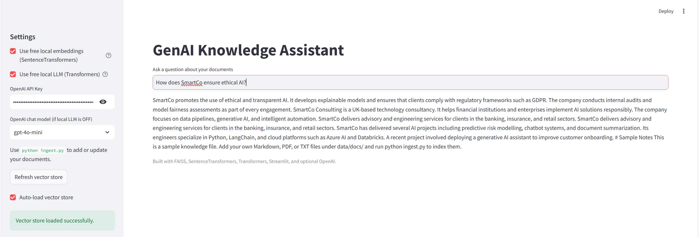

# 🧠 GenAI Knowledge Assistant




A lightweight **retrieval-augmented generation (RAG)** app built with **LangChain**, **FAISS**, and **HuggingFace** (can be used fully **offline and free** for experimental tasks if don't want to use paid openAI credits).  
This project demonstrates how to build a retrieval-based knowledge assistant using your own documents without relying on paid APIs.

---

## 🚀 Features
- ✅ **Offline / Free** – Uses `sentence-transformers` and `flan-t5-small` locally (no OpenAI key needed)
- 🔍 **Document Search** – Indexes and retrieves contextually relevant information using FAISS
- 💬 **Conversational Interface** – Ask natural language questions about your files
- 🧩 **Modular Architecture** – Swap in OpenAI or HuggingFace models easily
- 🌐 **Streamlit UI** – Simple, interactive web interface

---

## 📦 Installation

Clone the repository and install dependencies:

```bash
git clone https://github.com/rmehmood786/genai-knowledge-assistant.git
cd genai-knowledge-assistant

python -m venv .venv
.venv\Scripts\Activate.ps1  # (on Windows PowerShell)

pip install -r requirements.txt
```

---

## 🧱 Project Structure
```
genai-knowledge-assistant/
│
├── app.py                # Streamlit interface (main app)
├── ingest.py             # Indexes local documents into FAISS
├── config.py             # Configuration (API key, paths)
├── data/
│   ├── docs/             # Place your .txt/.md/.pdf documents here
│   └── vectorstore/      # FAISS index will be stored here
├── .env.example          # Example environment file
└── README.md
```

---

## ⚙️ Usage

### 1. Add Your Documents
Put any `.txt`, `.md`, or `.pdf` files in `data/docs/`.

### 2. Create the FAISS Vector Store
```bash
python ingest.py
```
You’ll see a message like:
```
Saved FAISS index to data/vectorstore with 4 chunks.
```

### 3. Run the Streamlit App
```bash
streamlit run app.py
```

Then open your browser at:  
🔗 `http://localhost:8501`

### 4. Ask Questions
Example prompts:
- “What does SmartCo Consulting do?”
- “Which technologies are mentioned in my documents?”
- “Summarise the document about AI ethics.”

---

## 🧠 Models Used
- **Embeddings:** `sentence-transformers/all-MiniLM-L6-v2`
- **LLM (offline):** `google/flan-t5-small`
- *(Optional)* You can still switch to OpenAI models by unchecking “Use free local LLM” in the sidebar.

---

## 💡 Future Enhancements
- Add document upload support directly in the UI
- Include context preview under each answer
- Support PDF → text conversion
- Deploy via Streamlit Cloud or HuggingFace Spaces

---

## 👤 Author
**Rashid Mehmood**  
📧 [rashidmehmood5914@gmail.com](mailto:rashidmehmood5914@gmail.com)  
🔗 [LinkedIn](https://www.linkedin.com/in/rashid-mehmood-aimachinelearningengineer/) | [GitHub](https://github.com/rmehmood786)

---

## 🧩 Git Commands to Push Updates

From inside your project folder:

```powershell
cd "C:\Users\Rashid Mehmood\Downloads\genai-knowledge-assistant\genai-knowledge-assistant"
.venv\Scripts\Activate.ps1

git add .
git commit -m "update: fully offline version using HuggingFace + Flan-T5 with badges"
git branch -M main
git remote set-url origin https://github.com/rmehmood786/genai-knowledge-assistant.git
git push -u origin main
```

> ✅ **Note:** Ensure `.env` is in your `.gitignore` so your local API keys remain private.
